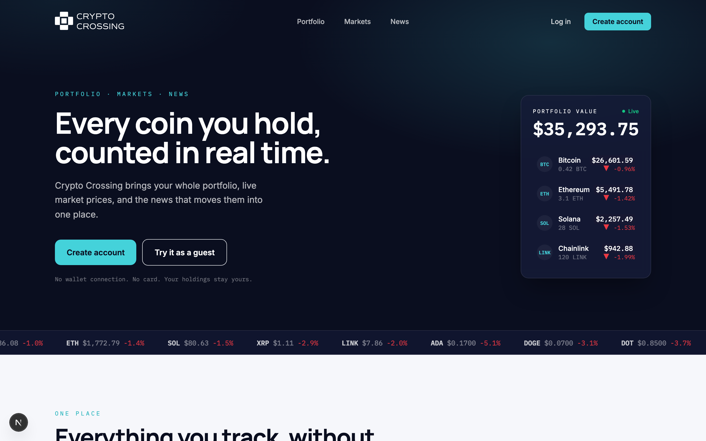

# Crypto Crossing

[](https://github.com/stf1094/cryptoCrossing/actions/workflows/ci.yml)
[](LICENSE)
[](https://crypto-crossing-7hai.vercel.app)

A cryptocurrency portfolio tracker built with Next.js and Firebase. Users can track their holdings, watch live market data for 500+ coins, and read curated crypto news. Supports both registered accounts and anonymous guest sessions.

**▶︎ [View the live demo](https://crypto-crossing-7hai.vercel.app)**



## Features

- 📊 **Portfolio tracking** — add coins, combine holdings, and see total portfolio value update in real time
- 📈 **Live market data** — 500 coins from the CoinGecko API with 24h / 7d / 30d change and sortable columns
- 🔥 **Trending** — "hot" and "cold" movers surfaced in a carousel
- 📰 **News** — general, Bitcoin, and altcoin news feeds
- 🔐 **Auth** — email/password accounts plus one-tap anonymous guest login
- 💾 **Persistence** — auth and market state persisted to localStorage for fast reloads

## Tech Stack

- **Framework:** Next.js (App Router) + React
- **State:** Redux Toolkit with `reduxjs-toolkit-persist`
- **Backend:** Firebase Authentication & Cloud Firestore
- **Data fetching:** SWR + CoinGecko API
- **Styling:** Tailwind CSS
- **Notifications:** React Toastify

## Getting Started

### Prerequisites

- Node.js 20+
- A [Firebase](https://firebase.google.com/) project with Authentication (Email/Password + Anonymous) and Firestore enabled

### Installation

```bash
# 1. Clone and install
git clone https://github.com/stf1094/cryptoCrossing.git
cd cryptoCrossing
npm install

# 2. Configure environment variables
cp .env.example .env.local
# then fill in your Firebase config values

# 3. Run the dev server
npm run dev
```

Open [http://localhost:3000](http://localhost:3000).

### Environment Variables

See [.env.example](.env.example) for the full list. All `NEXT_PUBLIC_*` Firebase
values are safe to expose to the browser — that's expected for a Firebase web
app. Your data is secured by **Firestore Security Rules**, not by hiding these
keys.

## Scripts

```bash
npm run dev     # start dev server on localhost:3000
npm run build   # production build
npm start       # start production server
npm run lint    # lint
```

## Architecture

### State (Redux)

The store ([store/index.js](store/index.js)) is split into slices: `auth`,
`portfolio`, `profile`, `news`, and `market`. Only `auth` and `market` are
persisted to localStorage.

### Firestore data model

```
profiles/{userId}
  ├─ uid, email, total
  └─ coins/{coinId}    (subcollection)
       └─ coinId, name, amount, currentPrice, value

news/
  ├─ general/generalNews/{newsId}
  ├─ bitcoin/bitcoinNews/{newsId}
  └─ alts/altsNews/{newsId}
```

### Data flow

1. Portfolio holdings are fetched from Firestore per user.
2. Market data is pulled from CoinGecko in two pages of 250 coins (with a delay between requests to respect rate limits).
3. Prices sync back into the user's Firestore portfolio and the profile total is recalculated after every mutation.

## Notes

- CoinGecko has rate limits; the market fetch spaces out its page-2 request to avoid `429`s.
- All app pages are client components (`"use client"`) since they rely on Redux, hooks, and browser APIs.

## License

[MIT](LICENSE) © stf1094
